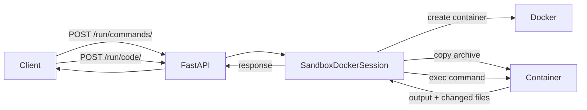

# Project Overview

`daiv-sandbox` is a FastAPI application for securely executing arbitrary commands and untrusted code in transient Docker containers, optionally using gVisor (`runsc`) for enhanced isolation. It is designed as a code/commands executor for DAIV agents. The stack includes Python 3.14, FastAPI, Docker SDK, Pydantic, and `uv` package manager.

## Repository Structure

```
- daiv_sandbox/       Core FastAPI application (main.py, config.py, sessions.py, etc.)
- tests/              Pytest test suite for unit tests.
- .github/workflows/  GitHub Actions for CI (lint, test) and Docker image publishing.
- Dockerfile          Multi-stage Docker build for production deployment.
```

## Build & Development Commands

All commands should be invoked via `make` (see `Makefile`).

### Linting & formatting

```bash
# Run all lint checks (ruff check + format check + pyproject-fmt)
make lint

# Auto-fix linting and formatting issues
make lint-fix

# Run type checking with mypy
make lint-typing
```

### Testing

```bash
# Run tests with coverage report
make test
```

## Code Style & Conventions

- **Formatter/linter:** ruff (line length 120, target Python 3.12)
- **Import sorting:** isort rules via ruff
- **pyproject.toml formatting:** pyproject-fmt
- **EditorConfig:** UTF-8, LF endings, 4-space indent for Python
- **Commit messages:** present tense, imperative mood, ≤72 char first line
- **Branch naming:** `feat/`, `fix/`, `chore/`, `security/` prefixes

## Architecture Notes



The application exposes two main endpoints:

- **`/run/commands/`** — Accepts an archive (base64-encoded tar.gz), extracts it into an ephemeral
  container, runs a list of commands sequentially, and returns command outputs along with any files
  changed by the last command.
- **`/run/code/`** — Executes arbitrary code in a specified language (currently Python only) with
  optional dependency injection via `LanguageManager`.

`SandboxDockerSession` manages ephemeral containers: it pulls/builds the image, creates the
container, copies archives into it (`copy_to_runtime`), executes commands (`execute_command`),
detects changed files by timestamp comparison, and tears down the container on exit. Timeout
enforcement uses SIGALRM (default 600 seconds).

## Testing Strategy

- **Framework:** `pytest` with `pytest-cov`, `pytest-mock`, `pytest-xdist`
- **Coverage config:** `.coveragerc`, source is `daiv_sandbox/`
- **Test files are in `tests/` directory.**

### Canonical test command

```bash
make test
```

### Common pytest workflows (if running pytest directly)

```bash
# Run all tests
pytest

# Run a specific file
pytest tests/test_<name>.py

# Run a specific test function
pytest tests/test_<name>.py -k "<test_name_substring>"

# Run by keyword
pytest -k "<keyword>"

# Show extra detail on failures
pytest -vv
```

## Security & Compliance

- **API key authentication** via `X-API-Key` header (env var `DAIV_SANDBOX_API_KEY`)
- **Optional gVisor (`runsc`) runtime** for enhanced container isolation
- **Ephemeral containers** destroyed after each request
- **Max execution time** enforced via SIGALRM (default 600s)
- **Secrets** loaded from `/run/secrets` or environment variables
- **License:** Apache 2.0
- **Sentry integration** for error tracking (optional, via `DAIV_SANDBOX_SENTRY_DSN`)

## Plan expectations (for agents proposing changes)

When presenting a plan, include the following:

- validate plan by running `make test` and confirming that all tests pass
- update `CHANGELOG.md` based on the present changelog conventions

## Maintenance Notes

- Update this file when:

  - `Makefile` targets change
  - the repo structure changes (new key packages/dirs)
  - tooling changes (ruff/mypy/pytest)
